# Selecting Blocks

There are several functions in ruleset that are responsible for selecting certain blocks by condition. Blocks selectors are limited by blocks scope.

## Default Block Types Reference

| Block Type Id        | Const                              |
| -------------------- | ---------------------------------- |
| *btid_nodraw*        | `RoommateBlock.NODRAW_TYPE`        |
| *btid_space*         | `RoommateBlock.SPACE_TYPE`         |
| *btid_oblique*       | `RoommateBlock.OBLIQUE_TYPE`       |
| *btid_out_of_bounds* | `RoommateBlock.OUT_OF_BOUNDS_TYPE` |

## Blocks Selection Functions

Let's take this scene, for example, and apply various block selector rules. Selected blocks will be colored red.


We will be using next style script.

```gdscript
@tool
extends RoommateStyle


func _build_rulesets() -> void:
    var ruleset := create_ruleset()
    # block selection code goes here
    ruleset.select_all_parts().surfaces.color.accumulate(Color.RED, 0.8)
```

### select_all_blocks

Simply selects all blocks in the scope.

```gdscript
ruleset.select_all_blocks()
```

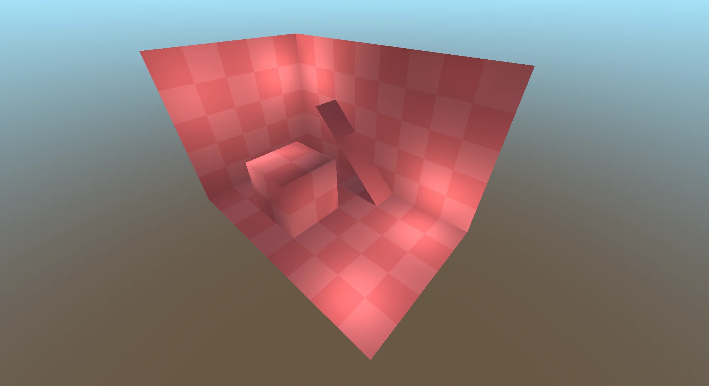

### select_blocks_by_type

Select all blocks of certain type. For example, we will select all oblique blocks.

```gdscript
ruleset.select_blocks_by_type(RoommateBlock.OBLIQUE_TYPE)
```

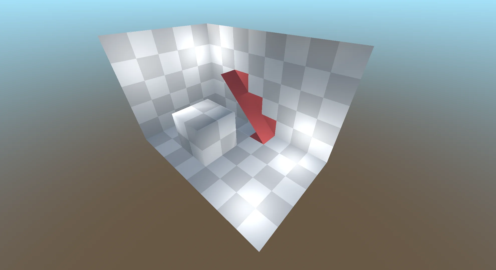

### select_blocks_by_extreme

Select blocks by extreme positions in current scope. 

```gdscript
ruleset.select_blocks_by_extreme(Vector3i.FORWARD)
```

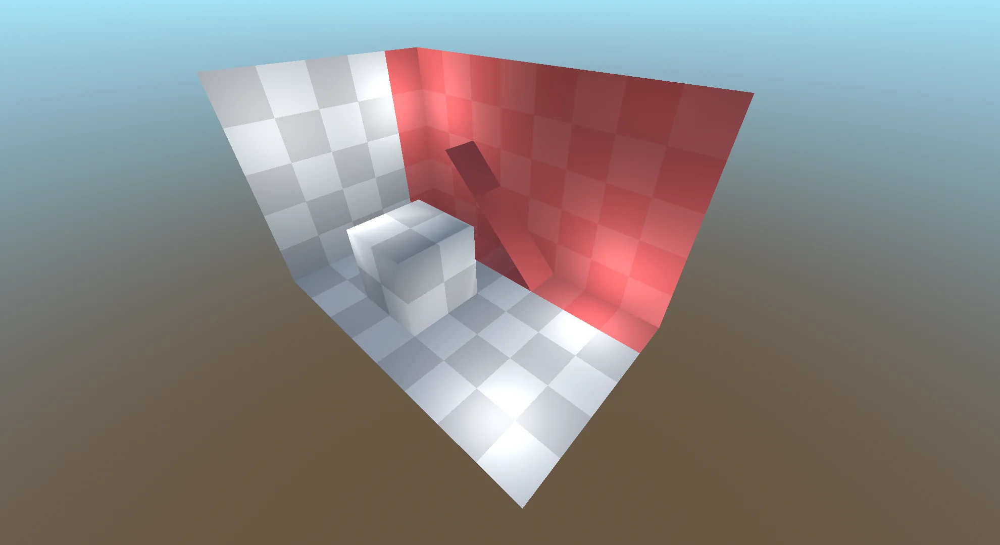

By passing 0 as a value for certain axis, it will be ignored, i.e. selection will be extruded along that axis. Number means how much rows will be selected from min/max positions. 

```gdscript
ruleset.select_blocks_by_extreme(Vector3i(2, 0, -1))
```

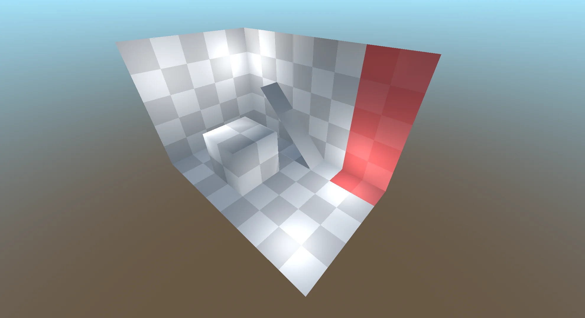

### select_edge_blocks

Block is selected if it's near edge. Array of `RoommateSegment` must be passed as a parameter. 

```gdscript
var segment_left := RoommateSegment.new(Vector3i.LEFT, 0)
ruleset.select_edge_blocks([segment_left])
```

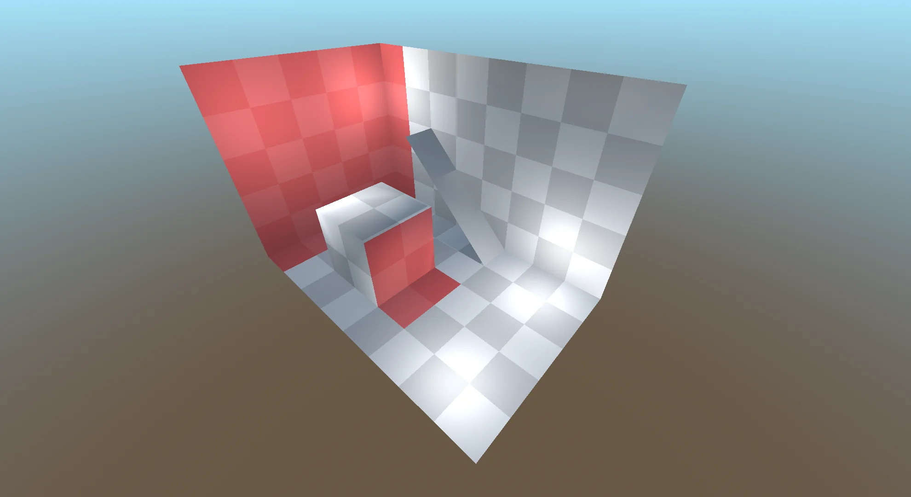

Size of selection can be increased by changing `max_steps` parameter, 

```gdscript
var segment_left := RoommateSegment.new(Vector3i.LEFT, 1)
ruleset.select_edge_blocks([segment_left])
```

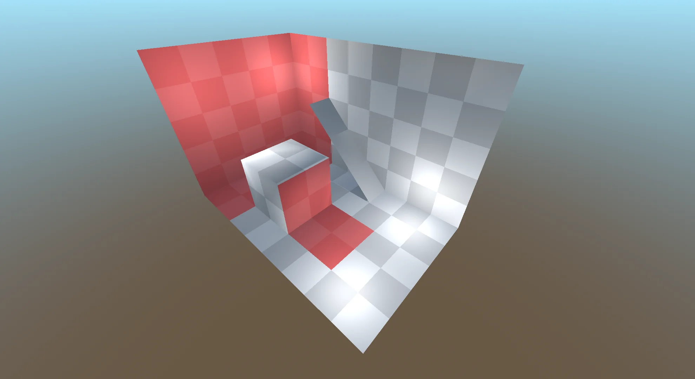

By passing multiple segments, block selection can be limited .

```gdscript
var segment_left := RoommateSegment.new(Vector3i.LEFT, 0)
var segment_down := RoommateSegment.new(Vector3i.DOWN, 0)
ruleset.select_edge_blocks([segment_left, segment_down])
```

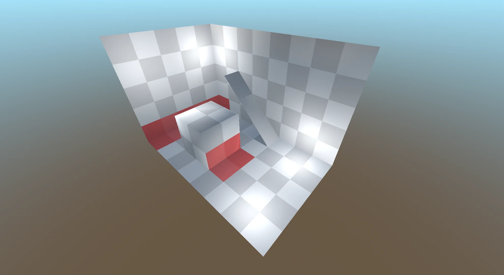

There are `select_edge_blocks_axis` function. It produces same result as above example

```gdscript
ruleset.select_edge_blocks_axis(Vector3i(-1, -1, 0))
```

### select_interval_blocks

Selects blocks by interval along several axes. In this example blocks are selected along X axis with step 2.

```gdscript
ruleset.select_interval_blocks(Vector3i(2, 0, 0))
```

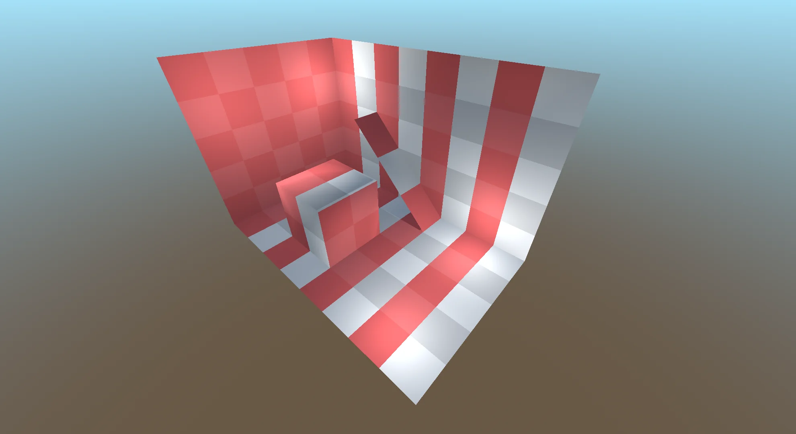

Block selection can be limited by using multiple axes. 

```gdscript
ruleset.select_interval_blocks(Vector3i(2, 3, 0))
```

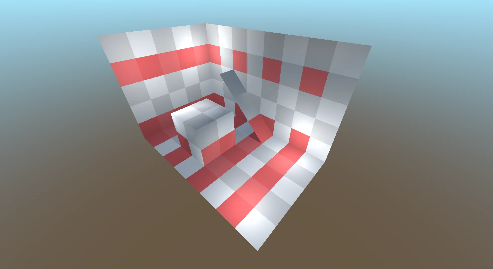

### select_inner_blocks

The most distant blocks from edges are selected along the axes.

```gdscript
var segment_forward := RoommateSegment.new(Vector3.FORWARD, 0)
ruleset.select_inner_blocks([segment_forward])
```

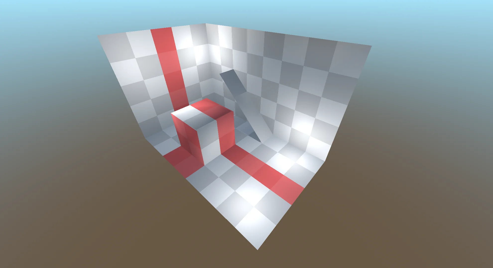

Set max_step parameter to positive number in `RoommateSegment` to increase distance tolerance.

```gdscript
var segment_forward := RoommateSegment.new(Vector3.FORWARD, 1)
ruleset.select_inner_blocks([segment_forward])
```

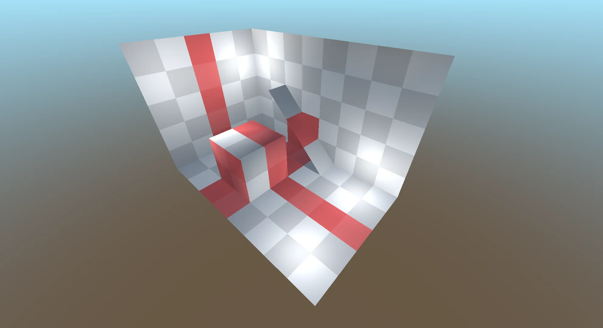

Selection of blocks can be limited, by using multiple segments with different axes.

```gdscript
var segment_forward := RoommateSegment.new(Vector3.FORWARD, 0)
var segment_up := RoommateSegment.new(Vector3.UP, 0)
ruleset.select_inner_blocks([segment_forward, segment_up])
```

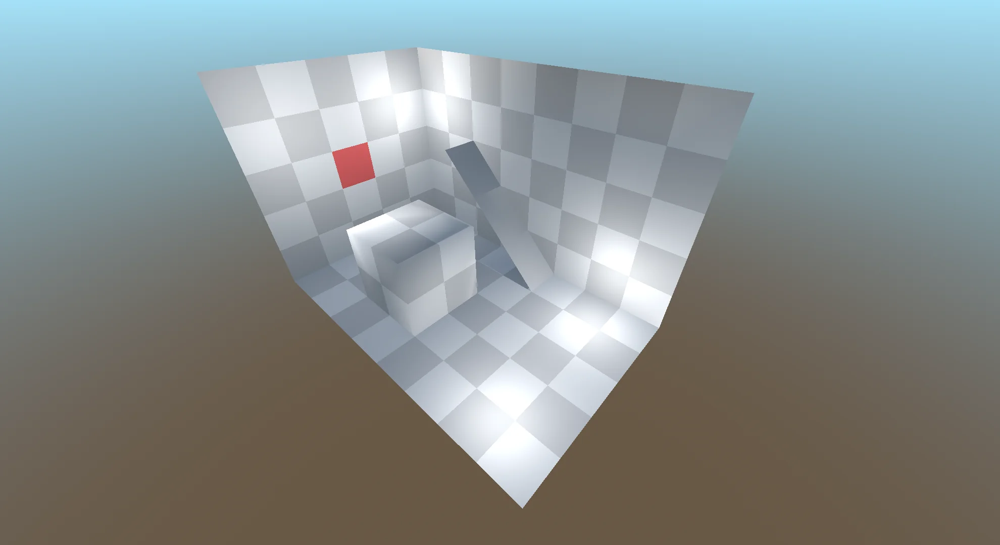

For convinience, these functions are exists. The result are the same as above

```gdscript
ruleset.select_inner_blocks_uniform([Vector3i.FORWARD, Vector3i.UP], 0)
```

```gdscript
ruleset.select_inner_blocks_axis(Vector3i(0, 1, -1))
```

### select_random_blocks

Randomly selects blocks in the scope. 

First parameter is `density` must be between 0 and 1, and it's represents how many blocks are selected (0 is nothing selected, 1 is everything selected). 

Second parameter accepts `RandomNumberGenerator` and is used to generate random numbers. If second parameter is null, `randf()` is used instead.

```gdscript
var rng := RandomNumberGenerator.new()
rng.seed = hash("Roommate is cool!")
ruleset.select_random_blocks(0.4, rng)
```

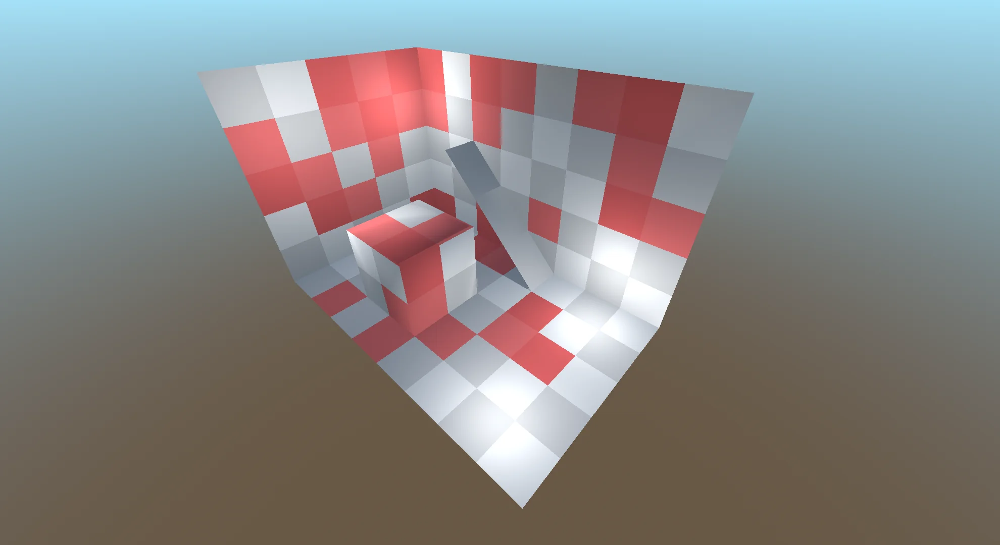

### select_blocks

Use this selector if there is need for more control over block selection. 

First parameter is prepare callback.  It's called before block selection process. Use `block_scope` to calculate values. Dictionary with calculated values must be returned, which is passed to selection callback.

Second parameter is block selection callback. Calculated values can be used here via `prepared_vars` parameter. Return true if blocks should be selected, otherwise false.

```gdscript
var prepare := func (blocks_scope: Dictionary) -> Dictionary:
    var max_y: float = NAN
    var min_y: float = NAN
    for block_position in blocks_scope:
        max_y = maxf(max_y, block_position.y)
        min_y = minf(min_y, block_position.y)
    return { "sin_center": roundi((max_y - min_y) / 2 + min_y) }

var is_block_selected := func (offset_position: Vector3i, block: RoommateBlock,
        blocks_scope: Dictionary, prepared_vars: Dictionary) -> bool:
    var sin_center := prepared_vars["sin_center"] as int
    return (roundi(sin(offset_position.x)) + sin_center) == offset_position.y

ruleset.select_blocks(is_block_selected, prepare)
```

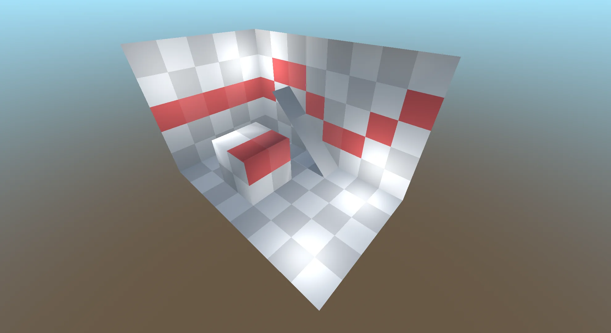

## Blocks Selector Inclusion modes

There is also an option to change inclusion mode of each selector. Code below will be used as example on how inclusion mode affects selection.

```gdscript
@tool
extends RoommateStyle


func _build_rulesets() -> void:
    var ruleset := create_ruleset()
    ruleset.select_blocks_by_extreme(Vector3(0, -1, -1))
    ruleset.select_blocks_by_extreme(Vector3(0, -1, 1))
    var selector := ruleset.select_blocks_by_extreme(Vector3(1, -1, 0))
    # selector mode changing code goes here
    ruleset.select_all_parts().surfaces.color.accumulate(Color.RED, 0.8)
```

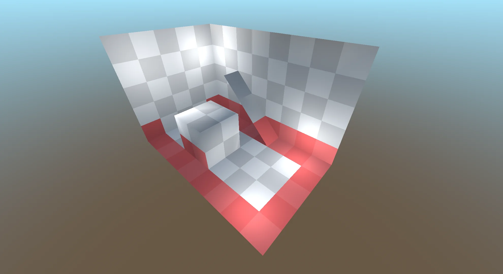

### include

Selects block no matter if it's selected or not. This is default behaviour and therefore result same as above.

```gdscript
selector.include()
```

### exclude

Opposite of `include`. It's deselecting blocks no matter if it's selected or not.

```gdscript
selector.exclude()
```

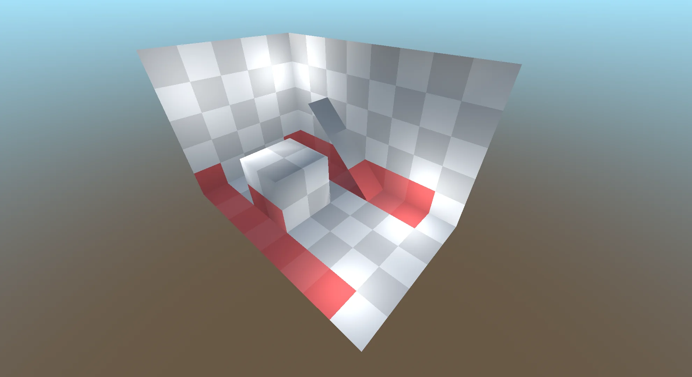

### invert

Inverts selection. If block already selected, it's unselect it. If block is not selected, it's selected

```gdscript
selector.invert()
```

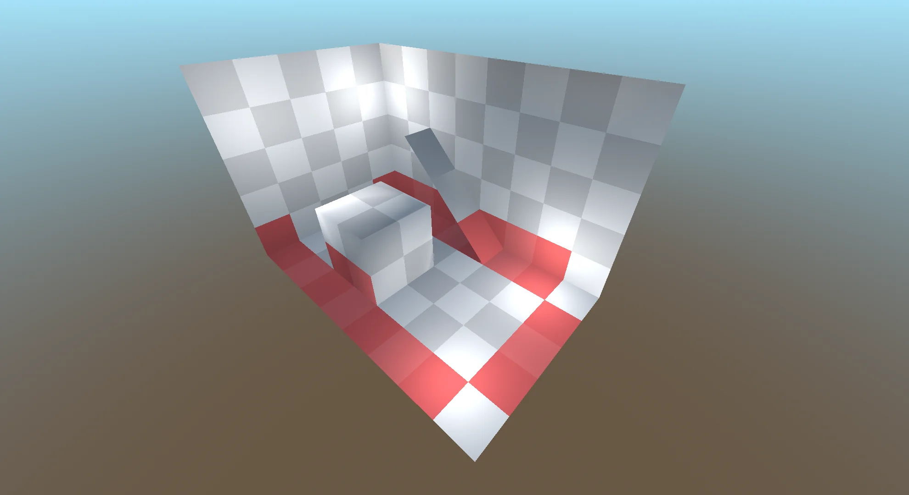

### intersect

Select only blocks that already selected. Other blocks are deselected.

```gdscript
selector.intersect()
```

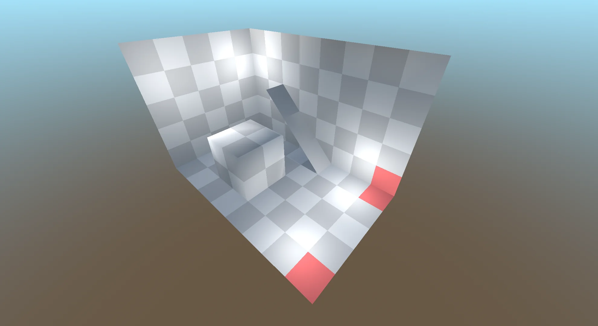
