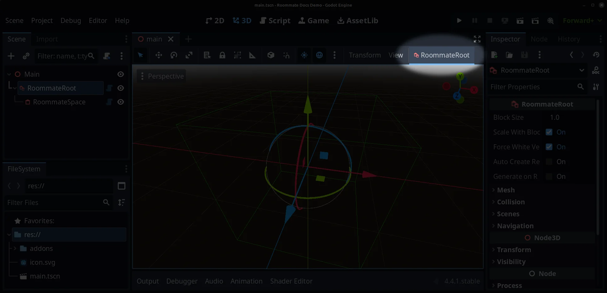
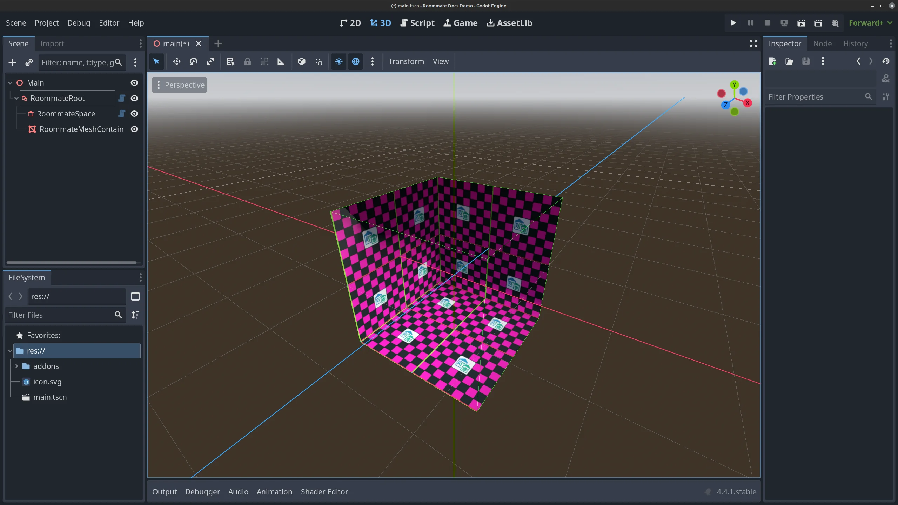
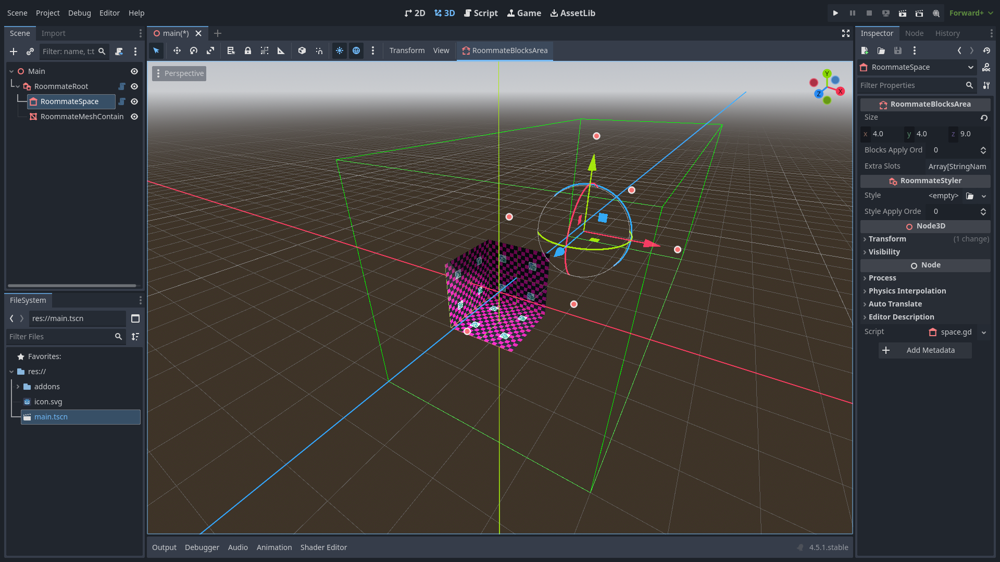

# How To Create Rooms

Let's see what this plugin can do. Follow these steps to create simple room:

1. Create empty 3d scene

2. Add RoommateRoot

3. Add RoommateSpace as a child of RoommateRoot

4. Select RoommateRoot

5. Press RoommateRoot's menu button and then press **Generate** 

Ta-Da! Now you have simple room!

You can resize RoommateSpace by pulling knob or changing size parameter in property window

You can also add several RoommateSpaces to give room a more complex layout.

For convinience, you can use RoommateOutOfBounds to fill space with blocks

You can use RoommateOblique to add slopes, stairs and etc.

By rotating the RoommateOblique node, you can change direction of the slope.

Use block_apply_order to change in what order areas can blocks. For example outer RoommateSpace and RoommateOutOfBounds have order of 0, but inner RoommateSpace have order of 1. Because of that, blocks of inner RoommateSpace is added after RoommateOutOfBounds and it's get rendered.

